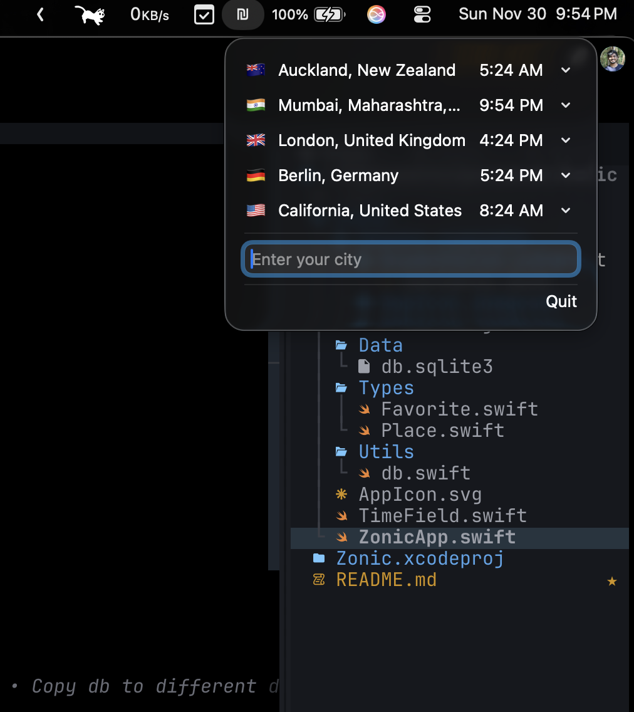
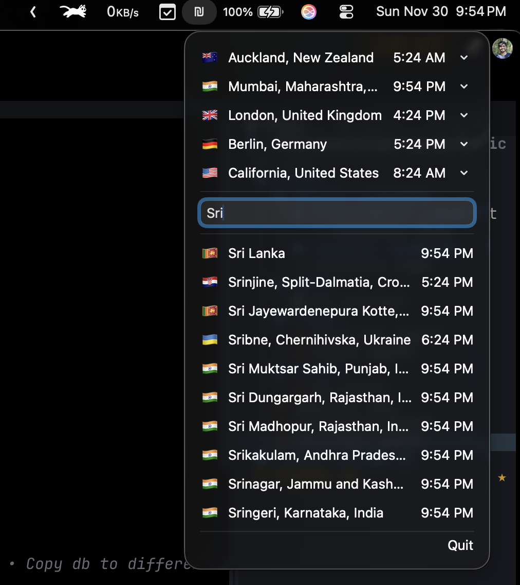

# Zonic

A macOS Menu Bar application that displays the current time for the cities in different timezones across the world. Quickly search for cities and add them to your favorites for instant access to their local time.

<table style="border: none" cellspacing="0" cellpadding="0">
  <tr>
    <td width="50%" align="center">
      
    </td>
    <td width="50%" align="center">
      
    </td>
  </tr>
</table>

## Installation

> Supported on macOS 14 (Sonoma) or newer.

1.  **Install with Homebrew:**

    ```bash
    brew tap AbhayVAshokan/tools
    brew install --cask zonic
    ```

    **Note:** Zonic is currently unverified as I do not own an Apple Developer account. When you first try to open the app, macOS might display a warning stating "Apple could not verify that Zonic is free of malware." To bypass this:
    - Go to **System Settings** > **Privacy & Security**.
    - Scroll down and click the **Open Anyway** button, which will appear briefly after your attempt to open the app.

2.  **Add to Login Items (Optional):**
    For Zonic to launch automatically when you log in, add it to your Login Items:
    - Open **System Settings** (or System Preferences).
    - Go to **General** > **Login Items**.
    - Click the **+** button under "Open at Login" and select `Zonic` from your `/Applications` folder.

## Data Source

The `db.sqlite3` database is constructed from information sourced from Wikidata, compiled through the [dr5hn/countries-states-cities-database](https://github.com/dr5hn/countries-states-cities-database) project.

## Development

### Prerequisites

- macOS
- Xcode

### Build and Run

1.  **Clone the repository:**
    ```bash
    git clone https://gitlab.com/AbhayVAshokan/Zonic.git
    cd Zonic
    ```
2.  **Open in Xcode:**
    Open the `Zonic.xcodeproj` file in Xcode.
3.  **Run the application:**
    Select a macOS target (e.g., "My Mac") and click the "Run" button (Cmd + R).

The application will appear in your macOS menu bar. Click on the menu bar icon to interact with it.

## Schema

### `places` Table

| Column   | Type     | Constraints               |
| :------- | :------- | :------------------------ |
| id       | INTEGER  | PRIMARY KEY AUTOINCREMENT |
| name     | TEXT     | NOT NULL                  |
| timezone | TIMEZONE | NOT NULL                  |
| flag     | TEXT     | NOT NULL                  |
| type     | TEXT     | NOT NULL                  |

### `favorites` Table

| Column     | Type     | Constraints                                 |
| :--------- | :------- | :------------------------------------------ |
| id         | INTEGER  | PRIMARY KEY AUTOINCREMENT                   |
| place_id   | INTEGER  | NOT NULL, FOREIGN KEY REFERENCES places(id) |
| label      | TEXT     | NOT NULL                                    |
| created_at | DATETIME | NOT NULL DEFAULT CURRENT_TIMESTAMP          |

## Roadmap

- Allow editing of favorite labels.
- Auto-focus search text field on appear.
- Reduce bundle size of the bundle by using a compressed DB.
- Potentially allow reordering of favorites.
- More robust error handling and user feedback.
- Automatically add App to "Login Items"
